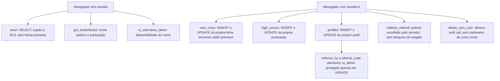

# Validação das fronteiras de confiança Supabase

Data: 08/10/2026. Aplicação: Atlas Arcade. Fases: `20261007224924_atlas_arcade_trust_expand.sql` e `20261007224929_atlas_arcade_trust_lockdown.sql`.

## Base remota e âmbito

O projeto `ilxdvpdssyhkziwozzlw` foi confirmado pela ferramenta Supabase como **Atlas Arcade**, estado **ACTIVE_HEALTHY**, região **eu-west-1**. O PostgreSQL remoto indica a versão **17.6**. A enumeração geral de projetos estava vazia, mas a consulta direta do identificador e as consultas ao catálogo identificaram inequivocamente o projeto.

A inspeção remota usou apenas consultas SELECT ao catálogo e contagens agregadas, além de operações de leitura das migrações, ramos e avisos de segurança. Não foram executadas funções da aplicação em produção: algumas funções de leitura também inicializam linhas. Não houve escrita, migração, criação de conta, alteração de configuração ou criação de ramo remoto. O único ramo Supabase devolvido era o principal; os ensaios decorreram localmente.

As migrações remotas registadas são 20260726, 20260727, 20260728 e 20260729. As fases de expansão e bloqueio ainda não estão aplicadas.

## Autoridade existente, antes da migração



| Caminho atual | Resultado confirmado |
|---|---|
| Escrita direta de saldo | **SIM**, para a própria linha autenticada. Inclui `coins`, `granted_today`, datas e `premium_tokens`. |
| Escrita direta de pontuação | **SIM**, INSERT/UPDATE da própria conta. Sem limites de jogo/pontuação na tabela. |
| Escrita direta de perfil | **SIM**, INSERT/UPDATE do próprio perfil. O acionador conserva `is_admin` anterior em UPDATE, mas não valida INSERT; uma conta sem perfil poderia inserir a própria indicação de administrador. Os dois perfis observados existem. |
| Reposição da associação de convite | **SIM**, o próprio perfil pode alterar `referred_by`; a função considera apenas essa associação para decidir se já houve resgate. |
| `add_premium_tokens(integer)` | **NÃO EXISTE** no catálogo público. A escrita direta da tabela já permite alterar o saldo premium. |
| Prémio do convite escolhido pelo cliente | **NÃO**. A função existente substitui `p_bonus` por 20 ou 100, conforme o perfil do autor. |
| Resgate concorrente | **SEM PROTEÇÃO SUFICIENTE** na função existente: leitura, alteração e atribuição não bloqueiam primeiro o perfil. |
| DELETE direto pelas políticas RLS | **NÃO**. Não existe política DELETE nas três tabelas. |
| TRUNCATE/REFERENCES/TRIGGER | Ambos os papéis possuem estes privilégios SQL. TRUNCATE não passa por RLS; isto é uma concessão excessiva, sem prova de um percurso TRUNCATE disponível na API REST atual. |

Nas três tabelas, `anon` e `authenticated` têm SELECT, INSERT, UPDATE, DELETE, TRUNCATE, REFERENCES e TRIGGER ao nível da tabela. Não foram encontradas ACL explícitas de coluna; os privilégios de coluna efetivos decorrem das concessões à tabela. `service_role` conserva os mesmos privilégios e ignora RLS. Os papéis de cliente não são superutilizadores nem têm BYPASSRLS. `authenticator` pode assumir anon, authenticated e service_role; o navegador recebe apenas a chave pública e a identidade de sessão.

As três tabelas pertencem a postgres, têm RLS ativo e não têm FORCE RLS. Todas as políticas existentes são permissivas e dirigidas a PUBLIC: SELECT próprio, INSERT próprio e UPDATE próprio. Em UPDATE, profiles declara USING e WITH CHECK próprios; high_scores e user_coins só declaram USING. Nesses dois casos o PostgreSQL reutiliza USING como WITH CHECK, pelo que a omissão não autoriza reassociar linhas a outra conta.

Não existem outras relações públicas, incluindo vistas, no catálogo observado. A pesquisa de funções fora de public não encontrou outro mutador destas tabelas. O auxiliar `pgbouncer.get_auth(text)` é privilegiado e não executável pelos papéis de cliente. A inspeção não exportou credenciais nem dados de autenticação.

## Esquema e compatibilidade

| Coluna | Tipo | Aceita NULL | Valor predefinido |
|---|---|---|---|
| `high_scores.user_id` | `uuid` | Não | Sem valor predefinido |
| `high_scores.game_slug` | `text` | Não | Sem valor predefinido |
| `high_scores.score` | `integer` | Não | `0` |
| `high_scores.updated_at` | `timestamp with time zone` | Não | `now()` |
| `profiles.id` | `uuid` | Não | Sem valor predefinido |
| `profiles.username` | `text` | Não | Sem valor predefinido |
| `profiles.created_at` | `timestamp with time zone` | Não | `now()` |
| `profiles.is_admin` | `boolean` | Não | `false` |
| `profiles.referral_code` | `text` | Sim | Sem valor predefinido |
| `profiles.referred_by` | `uuid` | Sim | Sem valor predefinido |
| `user_coins.user_id` | `uuid` | Não | Sem valor predefinido |
| `user_coins.coins` | `integer` | Não | `5` |
| `user_coins.granted_today` | `integer` | Não | `5` |
| `user_coins.accrual_at` | `timestamp with time zone` | Não | `now()` |
| `user_coins.last_reset` | `date` | Não | `((now() AT TIME ZONE 'utc'::text))::date` |
| `user_coins.premium_tokens` | `integer` | Não | `0` |
| `user_coins.updated_at` | `timestamp with time zone` | Não | `now()` |

- `profiles.id` é chave primária; username tem unicidade sensível a maiúsculas. referral_code tem um índice único simples válido, não uma constraint UNIQUE. Existe um índice não único em referred_by.
- `user_coins.user_id` é chave primária.
- `high_scores(user_id,game_slug)` é chave primária composta. A tabela real não tem a coluna id que existia na fixture anterior.
- Os três identificadores de conta referenciam `auth.users.id` por chaves externas validadas, com ON DELETE CASCADE.
- `profiles.referred_by` referencia profiles.id com ON DELETE SET NULL.
- Não existiam CHECK constraints para limites das fichas ou saldo premium não negativo.

Os tipos, valores predefinidos, nulidade, índices e chaves externas foram comparados com cada pressuposto da migração. As colunas existentes e os índices satisfazem o preflight. A migração corrigida também exige os campos username/updated_at, as restrições NOT NULL relevantes e as chaves externas de eliminação em cascata. Não elimina tabelas, pontuações ou saldos válidos.

As políticas existentes servem apenas a aplicação e restringem dados à própria conta. A substituição conserva esse alcance de leitura e retira as mutações do cliente. A ligação pública à classificação passa pela função que devolve apenas username/score, sem precisar de uma política SELECT global.

## Funções existentes

Todas as oito funções públicas pertencem a postgres. Todas têm EXECUTE concedido a PUBLIC, postgres, anon, authenticated e service_role; a concessão PUBLIC também é herdada.

| Assinatura | Execução e caminho de pesquisa atuais | Leitura/escrita e autoridade |
|---|---|---|
| `handle_new_user()` | SECURITY DEFINER; public, extensions | Acionador que insere perfil e saldo de new.id. Metadata fornece só o nome; is_admin=false e fichas predefinidas. Engole algumas falhas, podendo deixar inicialização incompleta. |
| `get_user_state()` | SECURITY DEFINER; public | Deriva auth.uid(), insere saldo em falta e devolve apenas saldo, datas e melhores pontuações da conta atual. Não aceita identificador de outra conta. |
| `get_leaderboard(text,integer)` | SECURITY DEFINER; public | Lê profiles/high_scores; devolve apenas username e score. Limite entre 1 e 100. Não devolve e-mail, UUID, administrador ou convites. |
| `delete_own_user()` | SECURITY DEFINER; public | DELETE em auth.users WHERE id=auth.uid(). Sem parâmetros; não permite escolher outra conta. A concessão a anon é excessiva, embora auth.uid() nulo torne o DELETE anónimo inoperante. |
| `redeem_referral(text,integer)` | SECURITY DEFINER; public | Altera referred_by e saldo premium da própria conta. Ignora p_bonus do cliente. Falta bloqueio da linha; pesquisa código armazenado pela igualdade com código convertido para maiúsculas. |
| `is_username_taken(text)` | SECURITY DEFINER; public | Responde apenas se um nome existe, sem distinguir maiúsculas. A disponibilidade do nome é informação pública do registo. |
| `protect_admin_flag()` | SECURITY INVOKER; caminho não fixado | Acionador BEFORE UPDATE em profiles. Conserva is_admin anterior; não valida inserções. |
| `gen_referral_code()` | SECURITY INVOKER; caminho não fixado | Gera oito caracteres e verifica colisão em profiles; não altera tabelas. |

Existem dois acionadores AFTER INSERT em auth.users, ambos a chamar handle_new_user: `on_auth_user_created` e `on_auth_user_created_profile`. A função atual usa ON CONFLICT e por isso as chamadas repetidas não duplicam linhas. A migração conserva um acionador, torna falhas de inicialização inesperadas atómicas e mantém um nome de recurso para contas sem username.

Os avisos Supabase confirmam os dois caminhos de pesquisa mutáveis e seis funções privilegiadas executáveis por anon. Duas leituras públicas são intencionais; as funções privadas e os auxiliares de acionadores passam a ter EXECUTE limitado. A proteção contra palavras-passe comprometidas está desativada; a configuração continua sob decisão do responsável. Fontes: [caminho de pesquisa](https://supabase.com/docs/guides/database/database-linter?lint=0011_function_search_path_mutable), [funções privilegiadas públicas](https://supabase.com/docs/guides/database/database-linter?lint=0028_anon_security_definer_function_executable), [proteção de palavras-passe](https://supabase.com/docs/guides/auth/password-security#password-strength-and-leaked-password-protection).

## Preflight dos dados

Só foram consultadas contagens agregadas, sem nomes, e-mails, UUID de contas ou conteúdo de sessões.

| Medida | Contagem |
|---|---:|
| Contas Auth / perfis / linhas de saldo / pontuações | 2 / 2 / 2 / 5 |
| Códigos não nulos em minúsculas / em maiúsculas | 2 / 0 |
| Perfis com referred_by definido | 0 |
| Grupos de códigos que colidem sem distinguir maiúsculas | 0 |
| Códigos nulos ou malformados | 0 |
| Saldos premium negativos ou próximos do limite inteiro | 0 |
| Estados de fichas nulos ou fora dos limites | 0 |
| Datas infinitas, reposição futura ou acumulação futura | 0 |
| Perfis, saldos ou pontuações sem conta Auth | 0 |
| Contas Auth sem perfil ou saldo | 0 |
| Autorreferências ou autores de convite órfãos | 0 |
| Pontuações negativas, jogos desconhecidos ou valores acima dos novos limites | 0 |

Os dados observados não provocam rejeição do preflight corrigido. Não foram copiados para os ensaios. As fixtures reproduzem a estrutura e usam apenas contas e valores sintéticos. A fotografia do catálogo não garante que os dados permaneçam iguais até à aplicação: o preflight transacional volta a validar as condições relevantes nessa altura.

## Alterações por fase

A fase A preserva o contrato e as permissões do cliente publicado; a fase B retira a autoridade de escrita antiga. A ordem e as condições estão no [procedimento faseado](supabase-rollout.md).

1. Acrescenta verificações de dados, NOT NULL e chaves externas de conta; estados inválidos abortam antes de alterar privilégios. Uma CHECK constraint impede futuros saldos premium negativos e estados fora dos limites.
2. Regista as funções de criação, estado, classificação e eliminação no próprio ficheiro de migração, conserva as assinaturas usadas pelo cliente e fixa o caminho de pesquisa.
3. Revoga EXECUTE anónimo das funções privadas e EXECUTE direto dos auxiliares de acionadores. Conserva as duas leituras públicas necessárias ao registo e à classificação.
4. Apenas B revoga políticas de escrita, privilégios de tabela e eventuais ACL explícitas de coluna. As concessões diretas do serviço e do proprietário são conservadas.
5. Acrescenta `profiles.referral_redeemed`, independente do FK referred_by. Liga-o aos resgates existentes que ainda têm associação e atualiza-o na mesma transação do prémio. Eliminar o autor do convite deixa de desbloquear um segundo prémio.
6. Uma identidade cujo registo Auth foi eliminado recebe estado nulo e não pode voltar a criar pontuações ou saldos.

A eliminação remove auth.users, profiles, user_coins e high_scores da própria conta. As chaves externas remotas também eliminam identidades, sessões, fatores MFA, tokens de uso único, autorizações/consentimentos OAuth e registos WebAuthn; scim_users conserva a linha com associação nula. A transação reverte o conjunto se uma restrição impedir o DELETE. Não há um parâmetro de outra conta nem necessidade de dar DELETE ao navegador.

O proprietário postgres tem USAGE no esquema auth e SELECT/DELETE em auth.users; a tabela Auth pertence a supabase_auth_admin e tem RLS ativo. O proprietário das funções tem BYPASSRLS, pelo que a eliminação não depende de conceder acesso Auth ao cliente. postgres também tem TRIGGER em auth.users e CREATE no esquema public. Não herda a propriedade de supabase_auth_admin; a configuração remota supautils.drop_trigger_grants autoriza expressamente postgres a remover acionadores de auth.users. Isso confirma a permissão de consolidar os dois acionadores sem alterar a propriedade da tabela. Referência: [permissão Supautils para remover acionadores](https://github.com/supabase/supautils/blob/master/README.md#drop-triggers).

Cada fase exige uma transação separada. A deve ser verificada com master antes de publicar o cliente. B exige adoção do cliente novo e confirmação explícita na transação. Não executar todos os ficheiros pendentes como uma única publicação. Nenhuma fase foi aplicada remotamente.

## Resultado isolado e segurança

**PASS** em PostgreSQL **17.10**, da mesma versão principal do remoto. A suite usa uma base nova, o catálogo real das três tabelas e funções, dados sintéticos e ligações independentes. Os testes Auth SQL mínimos não são apresentados como sessões reais: o percurso da aplicação foi verificado separadamente com Supabase Auth e JWT assinados.

| Ensaio | Resultado |
|---|---|
| Dados válidos e cinco pontuações existentes sobrevivem | PASS |
| Colisões de convite e saldo premium negativo abortam e conservam concessões anteriores | PASS |
| Criação sem nome e metadata com falsas indicações de administrador/prémio | PASS; perfil normal, cinco fichas e zero premium |
| Falha sintética no saldo durante bootstrap | PASS; conta, perfil e saldo revertem |
| Anon: escrita direta, TRUNCATE, pontuação, convite, funções de saldo, estado privado e eliminação | PASS; recusados |
| A: leitura de saldo/perfil/pontuações privados de B | PASS; sem linhas de B |
| A: alteração direta, criação de premium e argumentos para consumir/pontuar/eliminar B | PASS; recusados |
| Própria conta: estado, consumo diário antes de premium, limites de pontuação, convite e eliminação | PASS |
| Falha de eliminação por chave externa restritiva | PASS; conta, perfil, saldo e pontuações mantidos |
| Eliminação do autor de um convite seguida de outro resgate | PASS; segundo prémio recusado |
| Token de acesso anterior após eliminação | PASS; estado nulo, sem recriação de saldo/pontuação |

A suite real tem **16 testes**, incluindo o teste principal e 15 subtestes. A suite normal tem **28 testes**. As regressões de permissões privadas, resgate após eliminação do autor e dados inválidos falharam antes das correções e passaram depois.

### Concorrência real

Cada ensaio usa **16 ligações PostgreSQL distintas**. O teste mantém a linha bloqueada e consulta pg_stat_activity até confirmar que as 16 transações aguardam o bloqueio; só depois liberta a linha.

- 16 gastos de uma ficha com cinco disponíveis: exatamente cinco sucessos, saldo diário zero, sem saldo negativo.
- 16 resgates com p_bonus máximo: exatamente um sucesso e 20 fichas premium.
- 16 pontuações concorrentes: conserva o máximo, 115.
- 12 gastos e quatro atualizações com dia anterior: uma reposição de cinco fichas, cinco gastos autorizados e saldo zero; granted_today=5.

Não há prova de concorrência baseada apenas em Promise.all numa ligação única.

## Aplicação com autenticação real

**PASS**, sem contas ou pedidos de produção. A aplicação do PR correu com PostgreSQL 17.10, **Supabase Auth 2.197.0**, **PostgREST 16.4** e Chromium através de Playwright. Auth inicializou o seu esquema completo e emitiu sessões e JWT reais. Os segredos locais foram gerados em memória. No Windows, o código oficial de Auth precisou apenas de trocar a escuta com SO_REUSEPORT por uma escuta normal; a lógica de autenticação não foi alterada.

O navegador criou uma conta por e-mail/palavra-passe, confirmou perfil e cinco fichas, iniciou **One Strike** em modo Arcade e gastou uma ficha. O fim por tempo submeteu a pontuação zero pelo código real do cliente. A leitura de saldo e a atualização devolveram quatro fichas; a classificação pública mostrou apenas nome/pontuação. Pedidos PostgREST autenticados recusaram acesso ao saldo de B, criação de premium e um argumento para eliminar B.

Após sair e voltar a entrar com um convite pendente, a aplicação atribuiu 20 premium uma só vez e conservou saldo/perfil após recarregar. O botão de eliminação retirou a conta e a sua pontuação da função pública; a nova entrada foi recusada e o JWT anterior não recriou dados. O logout após eliminação devolveu o erro esperado de conta inexistente no Auth, mas a sessão local foi removida e a aplicação voltou ao modo sem conta.

Google OAuth, envio real de e-mails, retenção de logs/cópias de segurança e configuração de cookies em produção não fazem parte deste ensaio isolado.


A matriz executou master e PR na mesma base anterior, após A e após A+B. Master passou antes e após A; o PR passou após A e A+B. As duas combinações não suportadas falharam como esperado: função ausente para o PR anterior e escritas diretas 403 para master após B. Métodos, saldos e condições estão no [procedimento faseado](supabase-rollout.md).

## Riscos restantes

- **Publicação sujeita a aprovação:** repetir o preflight, aplicar apenas A e verificar master; depois publicar e verificar o cliente novo; só então aprovar B. Separadores antigos ativos precisam de atualização antes do bloqueio. Ver [critérios de aborto e recuperação](supabase-rollout.md).
- **FOLLOW-UP, ambiguidade do débito:** se o débito confirmar e a resposta se perder, a partida não começa e uma nova ação pode debitar outra ficha. O cliente não repete automaticamente o pedido nem faz reembolso arbitrário. Para fichas gratuitas, sem compra, conversão monetária ou prémios competitivos, esta limitação é proporcionalmente um seguimento, não um motivo adicional para redesenhar esta migração.
- Uma futura solução idempotente deve usar attempt_id UUID, unicidade por utilizador/tentativa, quantia e jogo associados, registo de resultado na mesma transação do débito e recuperação do resultado para uma repetição. Reutilizar um identificador com outros parâmetros deve falhar. Não foi implementada neste marco.
- As pontuações continuam declaradas pelo navegador. Os limites, identidade e conservação do máximo reduzem entradas malformadas; não provam as respostas. Para a oferta gratuita e sem prémios, o seguimento proporcional é validar tentativas/respostas nos jogos que precisarem de uma classificação mais fiável.
- Um JWT de uma sessão terminada pode continuar válido até expirar. Eliminar a conta retira a identidade da base e impede mutações novas; controlo imediato de sessões revogadas exigiria validação de session_id em auth.sessions.
- Uma classificação já colocada em cache pela aplicação pode conservar temporariamente o nome/pontuação eliminados. O código define 60 segundos de revalidação e stale-while-revalidate=120; não há invalidação imediata no DELETE remoto.
- A associação de resgates cujo autor já tenha sido eliminado antes desta migração não pode ser reconstruída a partir de referred_by nulo. Não foi inferido um histórico a partir de saldos atuais.
- A região eu-west-1 identifica a base, sem estabelecer localização de todos os logs, cópias de segurança, contratos ou garantias de transferências dos fornecedores.

## Reprodução

```bash
npm ci
npm test
# Numa instância PostgreSQL descartável que escute apenas em loopback:
# definir ATLAS_TEST_DB_PORT e, se necessário, ATLAS_TEST_DB_PASSWORD no processo.
npm run test:db
# Com a aplicação e Supabase Auth/PostgREST reais já configurados localmente:
# definir ATLAS_TEST_APP_URL e ATLAS_TEST_API_URL se diferirem dos valores locais.
npm run test:auth:local
```

O teste SQL cria e remove a sua própria base `atlas_trust_*`; só aceita loopback e nunca usa uma ligação de produção. A ausência da variável de porta marca a suite como não executada, não como validação bem-sucedida. A tarefa database-trust da CI define a porta e exige execução real.

O teste de autenticação gera contas sintéticas, usa as credenciais públicas observadas nos pedidos do próprio navegador e mantém sessões apenas em memória. Exige confirmação automática local e interface em inglês. Ao preparar um ambiente novo, inicialize o esquema completo do serviço Auth **antes** de aplicar a fixture da aplicação; as tabelas Auth mínimas da fixture servem apenas aos testes SQL. Numa instalação local Supabase que já tenha anon/authenticated/service_role, omita as três instruções CREATE ROLE da fixture. Reaplique as quatro migrações históricas e execute os dois clientes no estado anterior. Aplique A numa transação e volte a testar ambos. Só depois aplique B, noutra transação com o sinal explícito, e repita a matriz. Isto aplica-se apenas ao laboratório isolado.

A fotografia de Baikal e as obrigações dos restantes conteúdos estão em [licenciamento dos conteúdos](asset-licensing.md). A versão do cliente e a migração continuam sujeitas a aprovação de publicação.

A configuração Vercel desativa a publicação automática apenas de fix/release-quality-audit. Os outros ramos conservam o comportamento existente. Esta opção evita que uma atualização do PR publique o cliente antes de a migração ter aprovação. Referência: [configuração Git Vercel](https://vercel.com/docs/project-configuration/git-configuration).
